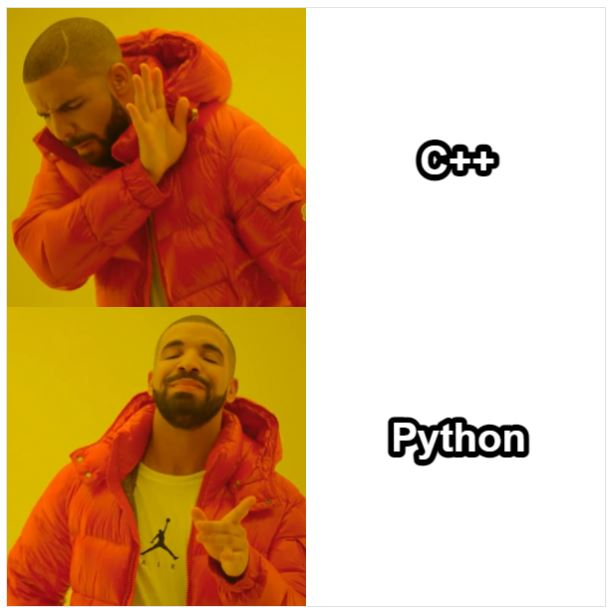

# NTU ME Robotics Lab - C++ Training (20220319)
Report : [pdf](20220319_training.pdf)

## Test Content (2022/6/3 released)
Detail : [pdf](test/2022_cpp_test.pdf)

Update log : [log](test/update_log.md)

Solution : [Link](test/sol/solve.md)

* Q1 – [GPA Calculator](test/q1/q1.md)
* Q2 – [Vocabulary 7000](test/q2/q2.md)
* Q3 – [Pointer](test/q3/q3.md)
* Q4 – [Bowling](test/q4/q4.md)
* Q5 - [Simple Calculator (Stack)](test/q5/q5.md)
* Q6 - [McDonald's (Queue)](test/q6/q6.md)

## Environment
* Docker - Ubuntu:18.04
* WSL2 - Ubuntu18.04
* gcc & g++ version : 7.5.0

## Docker
```shell
$ git clone https://github.com/Offliners/RobotLab-Cpp-Training-2022.git
$ cd RobotLab-Cpp-Training-2022/docker
$ docker build -t cpp_training . --no-cache
$ docker run cpp_training
```

## Usage
* 使用`Makefile`
```shell
$ git clone https://github.com/Offliners/RobotLab-Cpp-Training-2022.git
$ cd RobotLab-Cpp-Training-2022
$ make                      // 編譯所有檔案來產生執行檔，執行檔都放在build資料夾中
$ cd build
$ ./hello                   // 執行hello執行檔
Hello World!

$ make clean                // 使用完畢後可以輸入此指令來刪除所有執行檔
```

* 使用`CMakeLists.txt`
```shell
$ git clone https://github.com/Offliners/RobotLab-Cpp-Training-2022.git
$ mkdir build               // 建立build資料夾來放個專案
$ cd build                  // 前往build
$ cmake ..                  // 產生Makefile
$ make                      // 編譯來產生執行檔，執行檔都在各專案資料夾中
$ cd Hello                  // 前往Hello
$ ./hello                   // 執行hello執行檔
Hello World!

$ cd ..
$ make clean                // 使用完畢後可以輸入此指令來刪除所有執行檔
```
