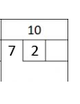

# Q4 – Bowling
最近因為實驗室有人確診，不幸受到波及的Offliner只能乖乖進行3+4隔離，但不幸中的大幸是Nintendo Switch推出了Sports這款遊戲，而Offliner深陷在保齡球這運動中

但保齡球的計分方式有些複雜，就由Offliner娓娓道來。首先可以看到下圖為保齡球10局的計分表

每局有兩次的出手機會(第10局例外)，假如第一局的第一次出手擊倒8瓶則會記為

若第一局的第二次出手只擊倒1瓶，則會記為

接著就可以計算第1局的得分為9，會記在第1局的下方

接著，如果第2局的第一次出手擊倒7瓶，而第二次出手把剩下的3瓶都擊倒，則稱為`Spare`(Spare會註記/)。發生Spare時會將上局的得分加上本局得滿分(10分)，再加上下一次出手的分數當成獎勵分，所以第2局發生Spare時會將上一局的9分加上第2局的滿分10分，再加上第3局的第一次出手9分，最後第2局的計分為28

若第3局又發生Spare，會將第二局的28分加上本局滿分10，再加上下一局的第一次出手7分，所以第3局會註記45

第4局因為沒有把剩下的球瓶都擊倒，所以第4局只會由第3局的分數加上本局得分9分，因此第4局為54分

而當第5局一次出手就全倒，稱為`Strike`(Strike會標記x)，Strike可以獲得之後兩次出手的分數，所以第4局的54分，加上本局滿分10分，再加上之後一次出手的10分，還有之後第2次出手的7分，最後第五局記分為81分

第6局又發生Strike，分數會由第5局的81加上第6局得滿分10分，在加上後兩次出手的得分，分別為7分與2分，所以第6局會註記為100分

依此類推，就可以算得遊玩圖片中的164分。而第10局比較特別，最多有3次的出手機會，但如果在第10局的前兩次出手沒能擊倒所有球瓶則會喪失第三次的出手機會，如

而第10局的第二次出手即使發生了Strike或Spare也不會有獎勵分數。為了程式方便，只要是該局Strike不用第2次出手，或者第10局喪失出手機會都會註記-，如下圖兩種情況

既然已經知道保齡球的計分規則，請幫幫Offliner來計算他的總分與他的積分，Nintendo Switch Sports只要有參加就有40積分，當打出一次Spare會乘上1.1，而打出Strike會乘上1.2，如遊戲畫面中，Offliner共擊出3次Strike與4次Spare，所以能獲得40*1.2*1.2*1.2*1.1*1.1*1.1*1.1≒101積分 

### Input
會輸入最多21個出手標記(第1到9局各2個，第10局3個，且分別用一個空白隔開)，由於Nintendo Switch Sports是採16人淘汰制，因此不一定會打滿10局，也可能輸入低於21個出手標記，例如6個，表示只打3局。

### Output
輸出最後總得分與積分，積分採四捨五入至整數

### Example 1
|[Input](./example_testcase/0.in)|[Ouput](./example_testcase/0.out)|
|-|-|
|8 1 7 / 9 / 7 2 x – x – 7 2 x – 9 / 7 / 8|164 101|

### Example 2
|[Input](./example_testcase/1.in)|[Ouput](./example_testcase/1.out)|
|-|-|
|x – x – x – x – x – x – x – x – x – x x x|300 357|

### Example 3
|[Input](./example_testcase/2.in)|[Ouput](./example_testcase/2.out)|
|-|-|
|x – 9 / x – 8 / x – 7 / x – 6 / x – 1 / x|200 192|

### Example 4
|[Input](./example_testcase/3.in)|[Ouput](./example_testcase/3.out)|
|-|-|
|8 / 7 / 6 /|43 53|